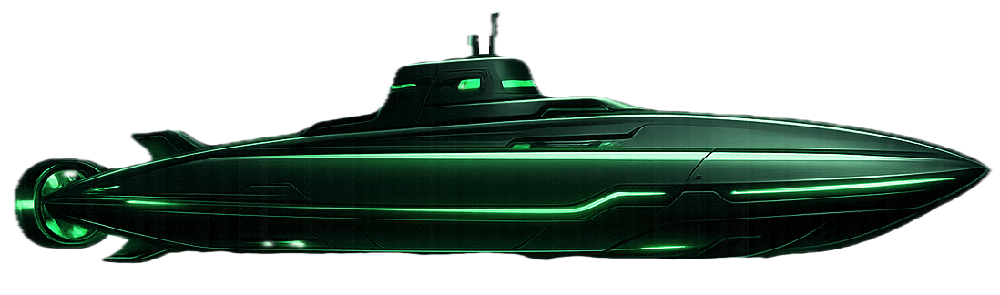

<p align="center">
  
</p>

<h1 align="center">NOOBMARINE</h1>

<p align="center">
  <strong>Asymmetric co-op submarine party game</strong><br>
  <em>One captain reads orders. The crew scrambles to comply. Chaos ensues.</em>
</p>

<p align="center">
  
  
  
  
</p>

---

## What is NOOBMARINE?

NOOBMARINE is a **local multiplayer party game** where one player is the **Captain** (on a laptop) and 1-9 other players are **Crew Members** (on their phones). The captain sees a list of tasks like *"Set CORE TEMPERATURE DIAL to 180 degrees"* and reads them aloud. The crew must find the right control on their phone and set it before time runs out.

Think **"Keep Talking and Nobody Explodes"** meets **"Spaceteam"** - but on a submarine.

### Key Features

- **No internet required** - runs entirely on local WiFi
- **No app install needed** - crew joins by scanning a QR code
- **No accounts, no login** - just run and play
- **PWA support** - installable on phones for fullscreen experience
- **11 interactive control types** - toggles, dials, sliders, keypads, and more
- **Procedural audio** - all game sounds generated in real-time
- **Cold War CRT aesthetic** - green-on-black submarine terminal theme

---

## Quick Start

```bash
# Install
git clone https://github.com/ni3ra5/Noobmarine.git
cd Noobmarine
npm install

# Run
node server.js
```

Then:
1. Open `http://localhost:3000` on the captain's laptop
2. Click **HOST GAME AS CAPTAIN**
3. Crew scans the QR code shown on captain's screen (or opens the URL on their phone)
4. Crew enters a callsign and joins
5. Captain clicks **LAUNCH MISSION**
6. Chaos begins!

---

## How It Works

```
CAPTAIN (laptop)                     CREW (phones)
  |                                    |
  |  "Set BALLAST PUMP to ON"         |
  |  "Tune SONAR to 270 degrees"      |
  |  "Enter code 3-7-1-9"             |
  |                                    |
  |  reads tasks aloud ------>    finds controls
  |                                    |
  |                            sets correct values
  |                                    |
  |  <---- task marked DONE           |
  |                                    |
  TIMER RUNS OUT                       |
  HP damage for missed tasks           |
  Next level (shorter timer)           |
```

- **Captain** sees ALL tasks for ALL crew members
- **Crew** sees ONLY their 8 controls (no task instructions)
- Communication is **verbal** - shouting across the room is the fun part
- Each level has a shorter timer (captain can adjust the base time) - difficulty escalates until the submarine sinks

---

## Control Types

The game includes 11 interactive control types, each requiring different interactions:

| Control | Interaction | Example Task |
|---------|-------------|--------------|
| Toggle | Tap on/off | "Set REACTOR SCRAM to ON" |
| Button | Tap to activate | "Activate TORPEDO TUBE" |
| Dial | Drag to rotate | "Set SONAR to 270 degrees" |
| H-Slider | Drag horizontal | "Set DEPTH to 60%" |
| V-Slider | Drag vertical | "Set POWER to 80%" |
| Multi-Slider | 5 independent bars | "Set PRESSURE to 3,7,5,2,8" |
| Number Wheel | Drag drum digits | "Set ARMING CODE to 42" |
| Stepper | Tap +/- buttons | "Set REACTOR to 7" |
| Button Sequence | Tap in order | "Enter sequence 3-1-4-2" |
| Switch Sequence | Flip in order | "Arm switches SW2, SW4, SW1, SW3" |
| Ring | Drag circular | "Charge REACTOR to 70%" |

Plus 14 additional demo control types available on the controls reference page.

---

## Tech Stack

| Layer | Technology |
|-------|-----------|
| Server | Node.js |
| WebSocket | [ws](https://github.com/websockets/ws) (only dependency) |
| Frontend | Vanilla JavaScript (zero frameworks) |
| Audio | Web Audio API (procedural) |
| PWA | Service Worker + manifest.json |
| QR Codes | Custom generator (no CDN) |
| Styling | CSS3 with custom properties |

**Total dependencies: 1** (`ws` for WebSocket)

No React. No Vue. No Angular. No webpack. No build step. Just `node server.js`.

---

## Project Structure

```
Noobmarine/
  server.js              # HTTP + WebSocket server (all game logic)
  package.json           # npm config
  public/
    index.html           # Homepage (host game + join)
    captain.html         # Captain's view (lobby + HUD + tasks)
    crew.html            # Crew's view (controls + game)
    controls.html        # Interactive control reference
    css/
      theme.css          # Global CRT theme
      captain.css        # Captain-specific styles
      crew.css           # Crew control styles
    js/
      socket.js          # WebSocket client (auto-reconnect)
      controls.js        # 25 control type renderers
      captain.js         # Captain UI logic
      crew.js            # Crew UI logic
      audio.js           # Procedural sound effects
      qrcode-mini.js     # QR code generator
    sounds/
      background.mp3     # Background music
    assets/
      logo.png           # Game logo
```

---

## Pages

| URL | Description |
|-----|-------------|
| `/` | Homepage - host game or join as crew |
| `/captain.html` | Captain's bridge - QR code, crew cards, game HUD |
| `/crew.html` | Crew station - name input, control panel |
| `/controls.html` | Interactive control type reference (25 types) |
| `/api/info` | Server IP/port (for QR code) |
| `/api/status` | Current game status |

---

## Game Flow

1. **Lobby** - Captain hosts, crew joins via QR
2. **Level 1** (90s timer) - Complete all tasks before time runs out
3. **Level 2** (80s timer) - New controls, new tasks, less time
4. **Level 3** (70s timer) - Pressure mounts...
5. **Level N** (5s minimum) - Until HP reaches 0

Each failed task costs **10 HP**. Submarine starts at **100 HP**.

---

## Network Requirements

- All devices must be on the **same WiFi network**
- No internet connection required
- Server auto-detects local IP address
- Works on any modern browser (Chrome, Safari, Firefox)

---

## Deployment

The game can be deployed to any Node.js hosting for online multiplayer:

**Render.com (free):**
- Connect GitHub repo
- Build: `npm install`
- Start: `npm start`

**Railway / Fly.io / Heroku** also work with zero config changes.

---

## License

MIT

---

<p align="center">
  <em>Built with vanilla JS, WebSockets, and submarine paranoia.</em>
</p>
